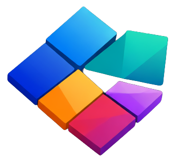

  

# Tessera

## 🧩 What is Tessera?

**Tessera** is a modular developer framework designed to help you build modern products faster.

It brings together a collection of Python-based services — like AI orchestration, user identity, file storage, notifications, and RBAC — into a composable, scalable foundation for any digital product. Each service is independent yet seamlessly interoperable, empowering teams to focus on delivering value instead of reinventing core infrastructure.

Tessera gives you:
- ⚡ **Speed** — Build and ship features faster by using ready-to-go components.
- 🧱 **Composability** — Plug in only what you need: identity, files, emails, AI, and more.
- 🔐 **Security-first design** — Auth, RBAC, and secure storage baked in.
- 🧠 **Smart defaults** — Optimized patterns and best practices built from experience.
- 💬 **Extensibility** — Easily integrate custom workflows, AI agents, and third-party tools.

It powers services like:
- `quore` – AI orchestration and reasoning
- `identies` – user identity and auth
- `vaulta` – file storage and signing
- `sendly` – notifications and events
- `custos` – RBAC and authorization

## 🧩 Why the name “Tessera”?

A **tessera** is a small tile used in mosaics — simple on its own, but when combined with others, it forms something beautiful and powerful.

The same is true for this framework: each service (identity, storage, AI, etc.) is a tile — a **tessera** — and together they compose the foundation of your product.

This name reflects the philosophy behind the framework:
- **Modularity**: each service stands on its own.
- **Harmony**: together, they create a cohesive system.
- **Craftsmanship**: like a mosaic, it’s designed with care and precision.